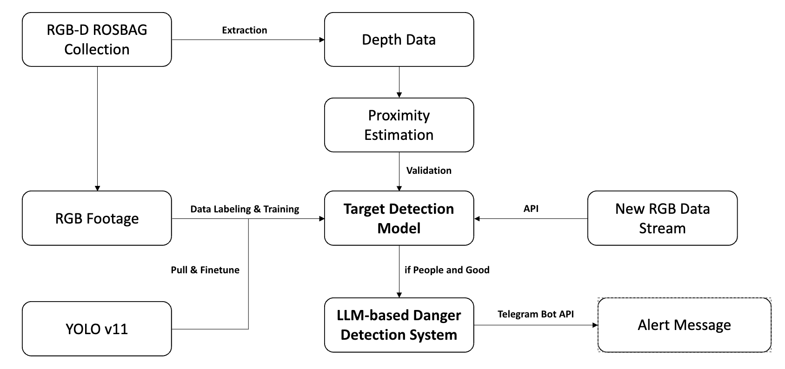
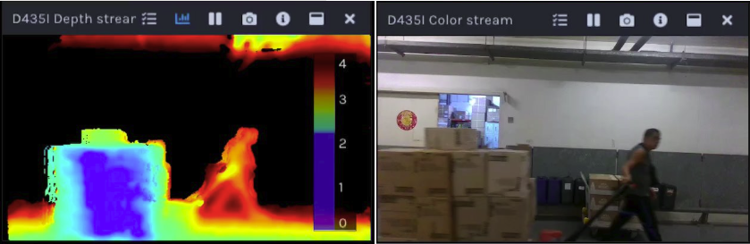
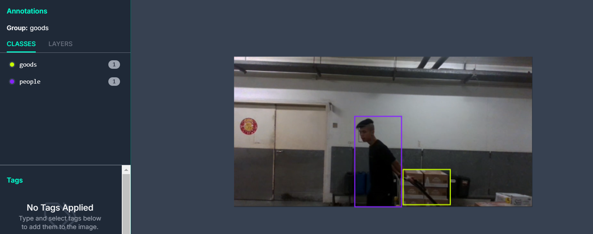
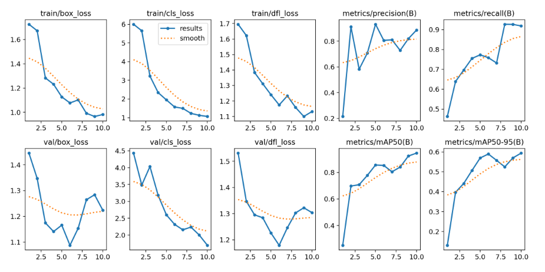
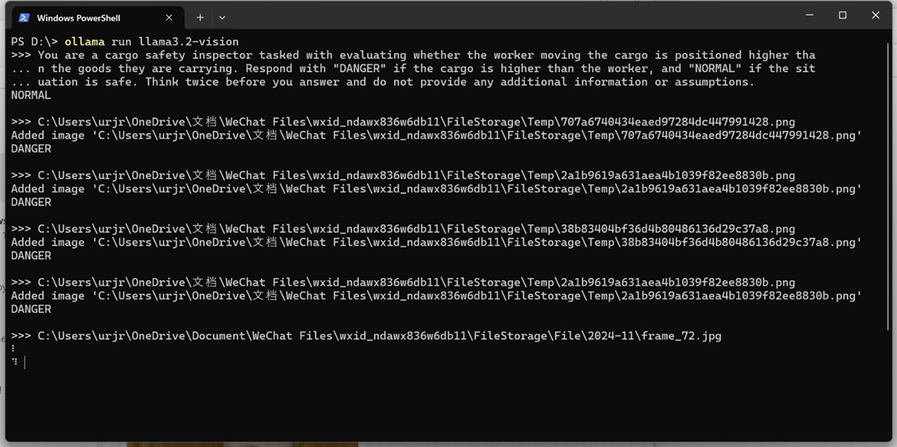
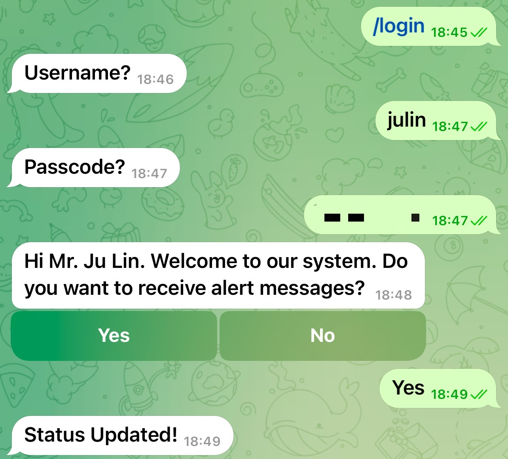
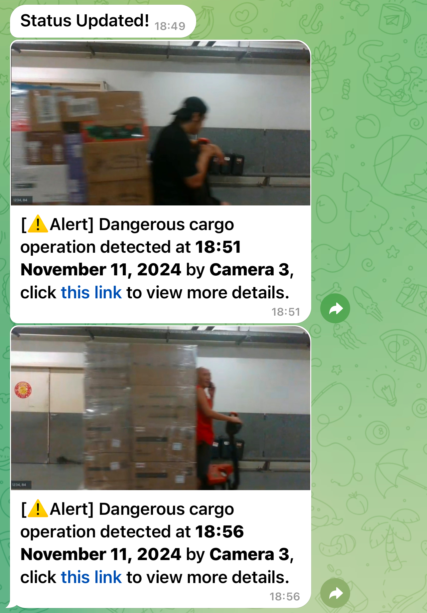

# YOLO and LLM-Based Visual Solution for Automated Cargo Safety Detection and Alerts at Hong Kong International Airport
[Full Report](https://github.com/Thorkee/YOLO-and-LLM-Based-Visual-Solution-for-Automated-Cargo-Safety-Detection-and-Alerts-at-HKIA/blob/main/AAE5103_Grp3_Report.pdf)

## Authors
**Ju Lin, Rouheng Ni, Ruilin Shi, Shuxuan Li, Jiayi Zuo**  
*Department of Aeronautical and Aviation Engineering, The Hong Kong Polytechnic University, Hong Kong*  


---

## Abstract
This project introduces an automated cargo safety detection system for **Hong Kong International Airport (HKIA)**. The system integrates **YOLO object detection** and **Large Language Models (LLMs)** to detect hazardous scenarios such as goods positioned higher than operators. Using **depth proximity estimation** during development, the system validates LLM-based classifications for reliability. Upon detecting hazards, real-time alerts are sent via **Telegram**, including annotated images and video clips. This solution enhances operational safety by enabling real-time monitoring and rapid communication of risks. Future work includes scaling for broader deployment and handling more complex cargo scenarios.

---

## Background
With increasing cargo volumes in airports, automated cargo safety inspection is paramount. This project aims to develop a real-time hazard detection system leveraging **YOLO** for object detection and **LLMs** for identifying dangerous scenarios. Alerts are sent via Telegram to ensure timely responses, improving the safety and efficiency of cargo operations at HKIA.

---

## Workflow
The workflow consists of several steps:
1. **Data Acquisition**: Captured using Intel RealSense RGB-D cameras, recording approximately 300GB of operational scenarios.
2. **Data Extraction**: RGB and depth streams are extracted from recorded data.
3. **Data Labeling**: Roboflow is used for annotating datasets.
4. **Model Training**: YOLO is trained using labeled datasets.
5. **Height Comparison**: Depth-based proximity estimation is used to compare goods' height with operators.
6. **Real-Time Alerts**: Hazard alerts are sent via Telegram, including annotated visuals and short video clips.



---

## Hardware Setup
The system uses the **Intel RealSense 435i RGB-D Camera**:
- **Depth Sensing**: Captures real-time depth data up to 30fps.
- **RGB Imaging**: Provides high-resolution color images for detection.

---

## Data Collection and Extraction
- **Data Collection**: Various zones of HKIA’s cargo handling areas were recorded using RealSense cameras.
- **RGB and Depth Extraction**: Using the `pyrealsense2` library, RGB streams and aligned depth maps are extracted for YOLO training. Below is an example of extracted data:



---

## Data Labeling and Model Training
### Data Labeling Using Roboflow
1. **Dataset Upload**: Upload images of goods and operators.
2. **Annotation**: Bounding boxes are manually drawn for "goods" and "people".
3. **Dataset Splitting**:
   - **80% Training**, **10% Validation**, **10% Testing**.
4. **Export**: Export labeled data in YOLO format.




### YOLO Model Training
- **YOLO Advantages**:
  - High speed and detection accuracy.
  - Real-time inference capabilities.
  - Single unified architecture.
- **Training Process**:
  - Install YOLOv11 via Ultralytics.
  - Fine-tune on the labeled dataset.
  - Validate and test the model.



_To test our model, you may call API Key: **mAG26LjDPqjrqmJOBrRs**, ver. 5 (unfortunately we run out of credits atm)._

---

## Model Deployment and Application
The trained YOLO model was deployed using **Roboflow Hosted Video Inference**, enabling automatic detection and analysis of goods and operators in video feeds.  
- **Python Integration**: API keys allow seamless interaction with the hosted model.
- **Prediction Data**: JSON results include bounding box coordinates, confidence scores, and object classes.

---

## Height Comparison Using Depth Data
Using depth data from the **Intel RealSense 435i**, the system compares the heights of operators and goods:
1. **Object Detection**: Detect bounding boxes for "goods" and "people".
2. **Depth Estimation**: Extract depth values from bounding boxes.
3. **Height Comparison**:
   \[
   \Delta h = h_{\text{goods}} - h_{\text{operator}}
   \]
   Alerts trigger when goods exceed operator height.

---

## LLM-Based Danger Detection System
The system uses **GPT-4o** and **Llama 3.2 Vision** for multimodal danger detection:
- **Prompt Design**: The model is instructed to classify scenarios as "DANGEROUS" or "NORMAL".  
  Example Prompt:
    ```
    You are a cargo safety inspector tasked with evaluating whether the worker moving the cargo is positioned higher than the goods they are carrying. Respond with 'DANGEROUS' if the cargo is higher than the worker, and 'NORMAL' if the situation is safe. Do not provide additional information or assumptions.
    ```

### Deployment
- **Cloud Deployment**: GPT-4-0613 is deployed on **Azure AI** for real-time evaluation.
- **Local Deployment**: **OLLAMA framework** with Llama 3.2-11B Vision is used for local testing.


---

## Automated Telegram Alert System
The Telegram bot sends real-time alerts when dangerous scenarios are detected:
- **Authentication**: Secure login for authorized personnel.
- **Alert Details**:
  - Timestamp of detection.
  - Camera ID.
  - Annotated image.
  - Video link for review.

  


---

## Summary
This project presents a complete solution for automated cargo safety detection at HKIA:
- **YOLO for object detection.**
- **LLM-based hazard identification.**
- **Real-time Telegram alerts.**

Future work includes scaling the system for broader use and improving model accuracy for complex scenarios.

---

## Contributions
| **Name**        | **Tasks**                                 |
|------------------|------------------------------------------|
| Ju Lin           | Data Collection, Detection System Development, Telegram Alerts         |
| Rouheng Ni       | Data Collection, RGB Data Extraction     |
| Ruilin Shi       | YOLO Deployment, Depth Analysis          |
| Shuxuan Li       | Data Collection, YOLO Deployment         |
| Jiayi Zuo        | YOLO Labeling and Training               |

---

## References
- YOLO: [You Only Look Once: Unified Real-Time Object Detection](https://doi.org/10.1109/CVPR.2016.91)
- GPT-4 Technical Report: [arXiv:2303.08774](https://arxiv.org/abs/2303.08774)
- Intel RealSense SDK: [GitHub - librealsense](https://github.com/IntelRealSense/librealsense)
- Ollama Framework: [GitHub - Ollama](https://github.com/ollama/ollama)
- Roboflow: [Roboflow Platform](https://roboflow.com)
- Telegram Bot API: [Telegram API Documentation](https://core.telegram.org/bots/api)
